<div align="center">
  
</div>

<div align="center">
  
</div>

<br/>

<!-- ================= ANIMATED NEURAL NETWORK ================= -->
<div align="center">
  
</div>

<p align="center">
  <sub>⚡ Live SVG animation — signals actually fire and propagate left → right across the network, no GIF involved.</sub>
</p>

<div align="center">
  
</div>

### 🧠 PROFILE

```yaml
role:        AI / Data Engineer
focus:       [Machine Learning, NLP, Mathematical Modeling, Full-Stack Systems]
mission:     Engineering scalable ML architectures and robust digital infrastructure
philosophy:  rigorous logic → elegant abstractions → optimal performance
status:      probably training something right now
```

<div align="center">
  
</div>

### 🛰️ TECH STACK

<div align="center">

</div>

<br/>

<div align="center">

| Layer | Tools |
|---|---|
| **AI / ML** | Python · TensorFlow · PyTorch · scikit-learn · NLP / Embeddings |
| **Backend** | FastAPI · Node.js · ASP.NET Core · Java |
| **Frontend** | React · TypeScript · HTML/CSS |
| **Data & Infra** | MongoDB · SQLite · Docker · AWS · Git |

</div>

<div align="center">
  
</div>

### 🚀 DEPLOYED ARCHITECTURES

| Repository | Description | Stack |
|---|---|---|
| [**creator-growth-lab**](https://github.com/mohannedbt/creator-growth-lab) | End-to-end analytics engine predicting growth drivers and performance. | `FastAPI` `ASP.NET Core` |
| [**Behavior-Risk-Engine**](https://github.com/mohannedbt/Behavior-Risk-Engine) | Modular system for detecting coordinated automated behavior on social platforms. | `Python` `NLP` |
| [**FakeNewsDetector**](https://github.com/mohannedbt/FakeNewsDetector) | Deep learning classifier leveraging embeddings to flag misinformation. | `Python` `ML` |
| [**Archivist**](https://github.com/mohannedbt/Archivist) | Contextual document management system with RAG integration and semantic search. | `Python` `SQLite` |
| [**Chat-nights**](https://github.com/mohannedbt/Chat-nights) | Real-time, horizontally-scalable chat infrastructure. | `Node.js` `WebSockets` |

<div align="center">
  
</div>

### 📊 SYSTEM METRICS

<div align="center">


</div>

<div align="center">

</div>

<div align="center">
  
</div>

<div align="center">
  
</div>

### 📡 NETWORK NODES

<div align="center">
<a href="https://www.linkedin.com/in/mohanned-ben-taleb-831919312/">

</a>
<a href="https://github.com/mohannedbt">

</a>
</div>

<div align="center">
  
</div>
